# Gentoo Linux实用指北
> 本文写作于2024年1月，文中内容具有时效性，仅供参考。

## 关于本文
本文是对笔者4个月来折腾Gentoo Linux的一个总结，包括了安装、优化以及配置的内容。需要注意：
1. 文中所述都是关于Amd64架构下Gentoo Linux的安装和配置；
2. 本文不是[Gentoo Handbook](https://wiki.gentoo.org/wiki/Handbook:AMD64)，请确保在安装之前／之后阅读该官方手册（建议食用英文版、中文版部分翻译不全且过时）；
3. 本文针对的是笔记本电脑安装桌面系统，内核配置、电源管理、桌面系统安装等部分视个人情况而定；
4. 笔者电脑配置为：CPU、GPU分别为牙膏场12代的i5和iRISxe，使用英伟达显卡的读者可能需要另行检索有关信息；使用UEFI。

## 目次
1. 基础系统安装
   - 准备安装环境
   - 从stage1 到stage3（可选）
   - 选择全局配置文件并安装基础系统
   - 配置内核（可选）
   - 杂项、工具及系统引导
2. 系统及软件配置
   - 选取桌面系统
   - XOrg（XMonad）
   - Wayland（Sway）
3. 吐槽及展望
4. 参考资料和学习资料

## 基础系统安装

### 准备安装环境

#### 引导
为了完成Gentoo Linux的安装、首先我们肯定要制作一个系统引导盘（LiveUSB）。Gentoo Linux的安装跟大部分发行版不同之处就在于它并没有提供一个有GUI或TUI界面作为安装向导的引导盘。相反，为了最大程度地客制化，它只提供了一个内置各种安装系统必备工具的不包含图形界面的基础系统；我们需要在以LiveUSB启动后`chroot`至本机磁盘手动（一般情况下）完成安装。这种繁琐安装方式给予了其最大的灵活性，真正意义上的选择之多样是Gentoo一个非常大的优势。

我们可以从清华镜像源处获得LiveUSB的磁盘映像文件。官方提供了三种磁盘文件，这里我们一般选择`install-amd64-mininal`即可，文件地址在：
```
https://mirrors.tuna.tsinghua.edu.cn/gentoo/releases/amd64/autobuilds/current-install-amd64-minimal/.
```
随后将该`iso`文件刻录到U盘上（经过了Hybrid处理，可以直接刻录到U盘上，不像FreeBSD）。这里大家各显神通就好。谨慎的读者还可以校验一下磁盘映像文件的完整性、校验文件也在上面给出的地址下。之后将目标设备关机、插上制作好的引导盘后**先关闭SecureBoot后**启动。然后你会看到OpenRC引导这Gentoo Linux启动，至此我们就完成了第一步：引导。

#### 连接至网络
进入LiveUSB的环境后，先运行`ifconfig`，看看除了`lo`之外是否有别的网卡设备被检测到（比如`wlan`）。如果没有那说明你的网卡不被支持，可以到互联网上检索并寻求帮助。有的话就可以运行`net-setup`（自带的一个非常贴心的脚本），按照指引连接至网络。如果使用`wlan`，大部分网络都是WPA2/3，并建议让`dhcp`决定ip地址。

随后可以`ping`一下`gentoo.org`，看看自己是否成功联网。然后视需求编辑`/etc/reslov.conf`（可用的编辑器有nano）。

#### 磁盘分区
接下来是很重要的一步：给目标设备的磁盘分区。（确保你的电脑使用不是BIOS启动，如果是请参考Handbook）一般至少需要三个分区、分别是EFI分区（512MB~1024MB）、swap分区（主要是笔记本电脑休眠时使用，一般等于你的运行时内存大小即可）以及根分区。这里也是，大家各显神通就好；[这里](https://wiki.gentoo.org/wiki/Handbook:AMD64/Installation/Disks)（Introduction to block devices至Partitioning the disk with MBR for BIOS / legacy boot）有Gentoo官方给出的方案，以及分区工具`fdisk`的手把手教学可供参考。下面给出我的方案、仅供参考：
```fdisk
Disk /dev/nvme0n1: 476.94 GiB, 512110190592 bytes, 1000215216 sectors
Disk model: [.*]
Units: sectors of 1 * 512 = 512 bytes
Sector size (logical/physical): 512 bytes / 512 bytes
I/O size (minimum/optimal): 512 bytes / 512 bytes
Disklabel type: gpt
Disk identifier: [.*]

Device            Start        End   Sectors   Size Type
/dev/nvme0n1p1     2048    2099199   2097152     1G Linux filesystem
/dev/nvme0n1p2  2099200    4196351   2097152     1G EFI System
/dev/nvme0n1p3  4196352   37750783  33554432    16G Linux swap
/dev/nvme0n1p4 37750784 1000214527 962463744 458.9G Linux filesystem
```
我额外分出了一个`/boot`分区，即`/dev/nvme0n1p1`。分完区后使用`fdisk -l /dev/[nvme0n1|sda|.*]`输出你的分区方案，最好记录一下，因为之后编辑`/etc/fstab`时会用到。

随后给这几个分区配置不同的文件系统。EFI分区须使用FAT32、其余参考[这里](https://wiki.gentoo.org/wiki/Handbook:AMD64/Installation/Disks)（Creating file systems）。这是我的方案：
```bash
mkfs.ext4 /dev/nvme0n1p1
mkfs.vfat -F 32 /dev/nvme0n1p2
swapon /dev/nvme0n1p3
mkfs.btrfs /dev/nvme0n1p4
```
然后挂载根目录：
```bash
mount /dev/nvme0n1p4 /mnt/gentoo
cd /mnt/gentoo
```
顺便，Gentoo的LiveUSB是没有预装OpenZFS所需的工具的，这时候你就需要使用其它镜像，即所谓的特殊情况；注意如果选择了第三方的镜像，可能会需要额外的安装步骤，见Gentoo Handbook。

#### 选择stage3档案
关于stage3，他们是Gentoo系统安装的种子。这时你需要作出选择：
- 不喜`systemd`？选择`OpenRC`；
- 对`glibc`感到不适？选择`musl-llvm`（注意，没有gcc和`glibc`一堆软件是编译不起来的）；
- 被迫还妄想症？选择~~OpenBSD（划掉）~~`hardened-selinux`；
- 喜欢禁欲？选择`nomultilib`。

时辰已到，请选择你的毒药。stage3清单可在[这里](https://mirrors.tuna.tsinghua.edu.cn/gentoo/releases/amd64/autobuilds/)查看。

作出选择后可使用wget或cURL将其下载到`/mnt/gentoo`下：
```
wget https://mirrors.tuna.tsinghua.edu.cn/gentoo/releases/amd64/autobuilds/current-stage3-amd64-desktop-openrc/stage3-amd64-desktop-openrc-*.tar.xz
```
即可。谨慎的读者这时又可以校验一下磁盘映像文件的完整性。

然后使用：
```
tar xpvf stage3-*.tar.xz --xattrs-include='*.*' --numeric-owner
```
解压。注意，一定要用这个命令解压。参数解释在Handbook中有，按需食用。

#### 配置`make.conf`并换源
编辑`make.conf`这一十分重要的配置文件（注意，是编辑`/mnt/gentoo/etc/portage/make.conf`文件而非`/etc/portage/make.conf`），决定我们的包管理器emerge编译时的参数等等，是十分重要的可以优化的地方。

笔者将详述一下重要的一定要配置的选项，更多敬请参考[官方指导](https://wiki.gentoo.org/wiki/Make.conf)。
- `COMMON_FLAGS`，作为编译时的一般参数，必备的参数有：`-march=native`（本设备硬件）、`-O2`（官方指导优化等级）、`-pipe`（管道代替中间文件）；
- `MAKE_OPTS`，一般用来设定make时的并行数，一般是中央处理器核心数的1/2；
- `CPU_FLAGS_X86`，使用`cpuid2cpuflags`工具获得（须`chroot`后用包管理器取得），为处理器优化可执行文件中使用的指令；
- `PORTAGE_TMPDIR`，包管理器后端存放中间文件的地方，内存大于16GB的建议设为`/tmp`、将其置于内存中，加快编译速度并减少对硬盘的大量读写、延长其使用寿命；
- `ACCEPT_LICENSE`，安装软件接受的许可证类型，官方提供了几个集合，但像笔者这种没什么节操的当然是用`*`全部接受了；
- `ACCEPT_KEYWORDS`，选择你安装的软件是使用稳定版本（amd64）还是激进版本（~amd64），后续是可以单独选择该软件使用何种版本的。

笔者的配置也放出来供参考：
```conf
COMMON_FLAGS="-march=native -O2 -pipe -finline-functions -fomit-frame-pointer"
CFLAGS="${COMMON_FLAGS}"
CXXFLAGS="${COMMON_FLAGS}"
FCFLAGS="${COMMON_FLAGS}"
FFLAGS="${COMMON_FLAGS}"
LDFLAGS="${COMMON_FLAGS} -Wl,-O2 -Wl,--as-needed -Wl,--hash-style=gnu -Wl,--sort-common -Wl,--strip-all"
LC_MESSAGES=C.utf8
MAKEOPTS="-j8 -l8"
CPU_FLAGS_X86="aes avx avx2 f16c fma3 mmx mmxext pclmul popcnt rdrand sha sse sse2 sse3 sse4_1 sse4_2 ssse3"
PORTAGE_TMPDIR="/tmp"
AUTO_CLEAN="yes"
ACCEPT_LICENSE="*"
ACCEPT_KEYWORDS="amd64"
L10N="en-US en"
LINGUAS="en-US en"
GRUB_PLATFORMS="efi-64"
VIDEO_CARDS="intel"
ALSA_CARDS="hda-intel"
# INPUT_DEVICES="libinput synaptics"
LLVM_TARGETS="X86"
USE="pulseaudio vulkan wayland cjk iwd -kde -gnome"
GENTOO_MIRRORS="https://mirrors.tuna.tsinghua.edu.cn/gentoo"
```

随后可以换个源（虽然来说默认的也没有被墙、而且Gentoo安装包由于是下载源码然后编译、与二进制发行版相比对网络的要求更低、不换也可以）。
对于`make.conf`，可以使用官方提供的工具`mirrorselect`：
```bash
mirrorselect -i -o >> /mnt/gentoo/etc/portage/make.conf
```
以TUI的方式选择镜像，也可以直接在`make.conf`中加上一行：
```
GENTOO_MIRRORS="https://mirrors.tuna.tsinghua.edu.cn/gentoo"
```

还需换源的文件为`/mnt/gentoo/etc/portage/repos.conf/gentoo.conf`，该文件指定了包管理器emerge使用的仓库地址。该文件缺省设置在`/mnt/gentoo/etc/portage/config/repos.conf`，用：
```bash
cp /mnt/gentoo/usr/share/portage/config/repos.conf /mnt/gentoo/user/portage/repos.conf/gentoo
```
创建后按[指南](https://mirrors.tuna.tsinghua.edu.cn/help/gentoo-portage/)修改`sync-uri`即可。

#### `chroot`
终于可以chroot了。为了在chroot环境中使用emerge从互联网上获取软件包，将DNS信息复制一下：
```bash
cp --dereference /etc/resolv.conf /mnt/gentoo/etc/
```

这时建议同步一下电脑的时钟，若误差太多可能会影响后续emerge的同步校验：
```bash
chronyd -q
```

然后使用官方提供的脚本，随后载入设置并设置一个招摇的提示幅：
```bash
arch-chroot /mnt/gentoo
source /etc/profile
export PS1="(chroot) ${PS1}"
```

别忘了把一开始分出来的EFI分区挂载一下，对笔者来说是：
```bash
mount /dev/nvme0n1p1 /boot
mkdir /boot/efi
mount /dev/nvme0n1p2 /boot/efi
```
现在，你已经成功地进入到新环境了。

### BootStrap（可选）
这时，我们处在了一个由先前下载并解压的stage3构建的一个基础系统中。它包括了标准库、编译器等Linux系统的必要组成部分，是由Gentoo Release Engineering Team（好高级的名字、发行工程诶）帮我们预先编译好的。根据[FAQ](https://wiki.gentoo.org/wiki/FAQ)，从头至尾构建这些所得的收益并不会很大，而所花的时间非常长，特别是如果你的gcc像笔者一样开启了`lto`、`pgo`等特性，对于一般电脑至少需要4小时（甚至gcc就要编译至少3次［至少是因为，如果你的gcc开了`pgo`、那么就需要重复编译5次］）。故读者需要明智地选择是否进行这一步。若不需要则**直接**进入下一部分『选择全局配置文件并安装基础系统』即可。选择该部分的读者在下一部分可忽略重复步骤（笔者将会指明）。

首先我们先同步一下本机的包管理器数据库（其实就是在`/var/db/repos/`下的一堆文件）：
```bash
emerge --sync
```
随后选取你要使用的基础系统配置文件，他们是Gentoo系统构建的砖块。（根据Handbook，）它不仅帮你决定了`USE`、`CFLAGS`等的值，更限定了系统上软件包的版本。根据你在选stage3时和实际需求选择即可。使用：
```bash
emerge profile list
```
列出可选的配置后运行：
```bash
eselect profile set [num]
```
应用。[这里](https://wiki.gentoo.org/wiki/Handbook:AMD64/Installation/Base)的Choosing the right profile一节有更多相关信息。

#### 从stage1 到stage2
官方提供了一个脚本，我们只需要运行它即可：
```bash
cd /var/db/repos/gentoo/scripts
./bootstrap.sh
```

#### 从stage2到stage3
理论上按照Gentoo官方的说法，这一步只需要`emerge -e @system`构建系统工具链即可。然而由于那个bootstrap.sh脚本估计是没怎么维护了，出来的gcc编译器缺少构建系统所需的一个特性、需要手动使用`USE=openmp`开启。这一步你也可以配置更多gcc的特性，详见[这里](https://wiki.gentoo.org/wiki/GCC)。为了开启这些特性，我们需要在`/etc/portage/package.use/`目录下创建一个文件（文件名无所谓，但为了可维护性有两种广泛使用的方案：创建一个文件存放所有软件的`USE`配置和为每一个需要配置的软件创建一个新文件）并写入：
```
sys-devel/gcc openmp
```
即可。（如果软件名没有重叠，你也可以省去类名直接写gcc。）

随后使用新的配置重新编译gcc：
```bash
emerge --oneshot sys-devel/gcc
```
漫长的等待过后，我们再运行；
```bash
emerge -e @system
```
即可重构系统的底层依赖。至此我们就完成了从stage1到stage3的构建，可喜可贺、可喜可贺。

由于我们已经选取过了系统的全局配置（那个profile），可以越过下一章开头的选取部分。

### 安装系统

#### 同步包管理器数据库并选取全局配置文件

首先同步包管理器所使用的软件包数据库（其实这一步就是下载放在不同文件夹里的ebuild文件）：
```
emerge --sync
```

现在需要选取系统配置文件，参考官方[学习资料](https://wiki.gentoo.org/wiki/Handbook:AMD64/Installation/Base)中Choosing the right profile一节，列出并选择：
```bash
emerge profile list
emerge profile set [num]
```

#### 配置`make.conf`文件
这时我们接着配置这个文件。先前由于没有`cpuid2cpuflags`这个工具，无法配置该环境变量，现在我们只需：
```bash
emerge --oneshot --ask app-portage/cpuid2cpuflags # 安装
cpuid2cpuflags # 输出
emerge -c app-portage/cpuid2cpuflags # 过河拆桥
```
即可。

然后配置显卡（一些软件如mesa可能会用到该变量）：
```bash
echo "VIDEO_CARDS=\"intel\"" >> /etc/portage/make.conf
```
怎么指导我的设备该填写怎样的值，需要怎样的配置呢？[AMD](https://wiki.gentoo.org/wiki/AMDGPU)、[Intel](https://wiki.gentoo.org/wiki/Intel)、Nvidia[开源](https://wiki.gentoo.org/wiki/Nouveau)和[闭源](https://wiki.gentoo.org/wiki/NVIDIA)。（还是老黄有牌面。）

#### 重建系统（可选）
这一步是可选的，且只在你做出了：
1. 修改全局的`USE`旗标后；
2. 出尔反尔、做出了跟你在选取stage3文件时截然相反地选择（比如从OpenRC投向了Systemd）；
3. 不赶时间、生活比较从容时才会带来好处。如果你赶时间，即使你做出了1、2中的行为也可以闲适自得地跳过这步，因为可能会需要一段等待的时间；

如果坚定信念决定重建，执行：
```bash
emerge -avuDN @world
```
然后按下回车就好。等emerge干好了工作，再用：
```bash
emerge --ask --depclean
```
移除不被依赖的软件包（这步十分残忍、请确认后再确认）。

#### 本地化
从这一节开始，就需要区分OpenRC和Systemd各自的步骤。笔者用的是OpenRC，使用Systemd的用户可以从[这里](https://wiki.gentoo.org/wiki/Handbook:AMD64/Installation/Base)的Optional: Using systemd as the system and service manager处开始按步骤使用不同的命令完成安装（两种方案在安装时只会有细节上的区别）。

首先我们设定时区，使用以下命令查看可用时区：
```bash
ls -l /usr/share/zoneinfo
```
所谓时区其实就是这个目录下的目录中细分的文件，非常符合所谓的Unix哲学、这很好。然后应用：
```bash
echo "Asia/Shanghai" > /etc/timezone
emerge --config sys-libs/timezone-data
```

接着我们设置本地语言环境（locale），修改（取消注释）`/etc/locale.gen`文件即可。编辑修改该文件后、应用：
```bash
nano /etc/locale.gen # 修改文件
locale-gen # 生成
eselect locale list # 列出可选的本地语言环境
eselect locale set [num] # 选取你需要的环境
```

最后我们使上述配置生效：
```bash
env-update && source /etc/profile && export PS1="(chroot) ${PS1}"
```

### 配置系统内核（手动配置可选）
终于到了配置内核的时候。有三种方案供各位选择：
1. 用发行版内核、发行版内核不会针对你的设备作任何修改、但主打的一个省心方便且快捷，官方甚至贴心地提供了编译好的内核、将会在下文提到；
2. 用混合驱动模式、使用官方提供的genkernel工具、能够自己配置内核、但对一些后续的扩展来说不是很方便（比如你想打一个cjkTTY补丁或者想用plymouth配置Boot Splash）、好处大概在于自动化；
3. 手动编译、即下文主要讲的方案。

#### 必要驱动安装
这一步是无论你使用什么内核安装方式都需要完成的。我使用emerge提供的集合方式安装（便于管理）。先创建目录：
```bash
mkdir /etc/portage/sets
```
这个目录就是我们存放所有集合文件的地方。随后在该目录下创建一个文件、文件名随意、但最好跟该集合包含的包有关。比如为了存放驱动，我们创建一个名为`firmware`的文件并在其中写入要安装的包：
```bash
touch /etc/portage/sets/firmware
echo "sys-kernel/linux-firmware" >> /etc/portage/sets/firmware # 需安装的linux-firmware包
echo "sys-firmware/sof-firmware" >> /etc/portage/sets/firmware # 需安装的sof-firmware包（声卡驱动）
```
随后使用：
```bash
emerge --ask @firmware
```
即可安装linux-firmware和sof-firmware两个包。如果不使用集合的方式，则将`@firmware`替换为两个包的名字即可（不需要`@`）。

#### 发行版内核安装
以下是使用GNU GRUB作为系统引导时的安装步骤，如果有特殊需求参考[这里](https://wiki.gentoo.org/wiki/Handbook:AMD64/Installation/Kernel)的Distribution kernels一节即可。

首先我们要安装installkernel这个包。如果你有在内核升级后自动帮你运行`grub-mkconfig`指令的话，需要打开该包的`grub`特性：
```bash
touch /etc/portage/package.use/installkernel
echo "sys-kernel/installkernel grub" >> /etc/portage/package.use/installkernel
```
随后创建kernel集合：
```bash
touch /etc/portage/sets/kernel
echo "sys-kernel/installkernel" >> /etc/portage/sets/kernel # 需安装的installkernel包
echo "sys-kernel/gentoo-kernel" >> /etc/portage/sets/kernel # 需安装的gentoo-kernel包（如果不想本机编译内核、安装gentoo-kernel-bin即可）
```

然后就安装。发行版内核很大，你需要等一等。
```bash
emerge --ask @kernel
```

#### 手动编译内核
同样创建kernel集合先安装需要的包：
```bash
touch /etc/portage/sets/kernel
echo "sys-kernel/gentoo-sources" >> /etc/portage/sets/kernel # 内核源文件
echo "sys-kernel/dracut" >> /etc/portage/sets/kernel # initramfs
```
Gentoo提供了许多内核，比如没有对Gentoo进行适配的vanilla、性能优化的zen、以及其他的分支，根据喜好／需求选择即可。至于用来生成initramfs的dracut，也可以用官方的genkernel替代；但需要注意的是genkernel至今未提供对plymouth的支持。

使用`emerge -a @kernel`安装后，即可开始配置：
```bash
cd /usr/src/linux-6.1.67-gentoo/ # 最后的文件夹名会根据你所安装内核及版本有所区别
make menuconfig # 基于curces的菜单式配置界面
```
关于内核配置，我不推荐使用`make localyesconfig`的方式，因为这种方式只会将正在使用的驱动改成`yes`（嵌入），建议只做为参考。在配置显卡／声卡／网卡的驱动时，不建议嵌入、而作为模块载入。否则可能导致找不到网卡、无声音、mpv报错等问题。关于内核各个选项的意义、推荐阅读金步国的[Linux-4.4-x86_64内核配置选项简介](https://www.jinbuguo.com/kernel/longterm-linux-kernel-options.html)，然后对照着配置就好。遇到不明白的就善用搜索。同时，在[官方文档](https://wiki.gentoo.org/wiki/Handbook:AMD64/Installation/Kernel)的Alternative: Manual configuration一章中有关于内核必须的配置提示及警告。Gentoo Wiki上也会写出一些对内核有特殊要求的包对应的配置要求，需要特别注意。比如这是iwd（`wpa_supplicant`的现代替代）所需的内核配置，写的十分详细：
```kernel
Security options  --->
    [*] Enable access key retention support
    [*] Diffie-Hellman operations on retained keys
Networking support  --->
    [*] Wireless  --->
        <M> cfg80211 - wireless configuration API
Cryptographic API  --->
    *** Public-key cryptography ***
    [*] RSA algorithm
    [*] Diffie-Hellman algorithm
    *** Block modes ***
    [*] ECB support
    *** Hash modes ***
    [*] HMAC support
    *** Digest ***
    [*] MD4 digest algorithm
    [*] MD5 digest algorithm
    [*] SHA1 digest algorithm
    [*] SHA1 digest algorithm (SSSE3/AVX/AVX2/SHA-NI)   // AMD64 and SSSE3
    [*] SHA224 and SHA256 digest algorithm
    [*] SHA256 digest algorithm (SSSE3/AVX/AVX2/SHA-NI) // AMD64 and SSSE3
    [*] SHA384 and SHA512 digest algorithms
    [*] SHA512 digest algorithm (SSSE3/AVX/AVX2)        // AMD64 and SSSE3
    *** Ciphers **
    [*] AES cipher algorithms
    [*] AES cipher algorithms (x86_64)                  // AMD64
    [*] AES cipher algorithms (AES-NI)                  // X86_AES
    [*] ARC4 cipher algorithm
    [*] DES and Triple DES EDE cipher algorithms
    [*] Triple DES EDE cipher algorithm (x86-64)        // AMD64
    *** Random Number Generation ***
    [*] User-space interface for hash algorithms
    [*] User-space interface for symmetric key cipher algorithms
    [*] Asymmetric (public-key cryptographic) key type  --->
        [*] Asymmetric public-key crypto algorithm subtype
        [*] X.509 certificate parser
        [*] PKCS#7 message parser
        <M> PKCS#8 private key parser                   // linux kernel 4.20 or higher
```
所以在手动配置内核所能带来的精简之外，安装软件时便可能需要额外的折腾，比如iptables、这个东西需要的内核配置特别多，但想要在QEMU里玩游戏还必须配置。如果你的笔记本电脑需要能用的电源管理，别忘了看[这篇电源管理](https://wiki.gentoo.org/wiki/Power_management/Guide)（建议别现麻烦，把`thermald`配一下）和[这篇关于休眠](https://wiki.gentoo.org/wiki/Suspend_and_hibernate)的文章。同时也注意一下时钟滴答、频率这些对性能影响较大的选项。

在大显神通之后，想必各位也完成了配置。推出menuconfig界面并保存之后，你的配置会被写入当前目录下的`.config`文件中。接下来使用：
```bash
make -j11 # 根据自己硬件调整
make modules_install
make install
dracut --force --hostonly # 生成initramfs，如果你在内核中配置了支持的压缩方式，别忘了指定，如 --xz
```
最后别忘记：
```bash
eselect kernel list # 查看可用内核
eselect kernel set [num] # 选取
```

### 杂项、工具、及系统引导

#### fstab文件
为了让系统知道该挂载硬盘的哪个分区、每个分区上装的是什么东西、用的是什么文件系统、挂载时需要什么参数、以及挂载的行为、优先级等，需要编辑`/etc/fstab`文件。具体的语法请看[这里](https://wiki.gentoo.org/wiki/Handbook:AMD64/Installation/System)的About fstab一节。下面是我的配置，供参考：
```fstab
/dev/nvme0n1p1    /boot        ext4    defaults        1    2
/dev/nvme0n1p2    /boot/efi    vfat    defaults        0    2
/dev/nvme0n1p3    none         swap    sw              0    0
/dev/nvme0n1p4    /            btrfs   compress=zstd:2 0    1
```
这个文件比较重要，千万别手抖。

#### 网络相关
我们先给自己的机器设一个主机名（注意：如果你在内核里指定了就不要冲突）：
```bash
echo gentoo > /etc/hostname
```

随后安装一个网络管理器。一般常用的是NetworkManager（如果你要用Gnome必装、KDE考虑、xfce谨慎、对于WM来说就太重了），还有就是Gentoo自己的netifrc、ConnMan这些。我用的是iwd，单独使用需开启`standalone`特性：
```bash
touch /etc/portage/package.use/iwd
echo "net-wireless/iwd client monitor standalone" >> /etc/portage/package.use/iwd
emerge -a iwd # 我使用集合来管理，但为了命令精简往后一次只需安装单个包时会直接安装
```
随后编辑`/etc/iwd/main.conf`文件：
```conf
# /etc/iwd/main.conf

[General]
EnableNetworkConfiguration=true
[Network]
NameResolvingService=resolvconf
```
最后使其开机自启：
```bash
rc-update add iwd default
```

也推荐Gentoo自己的netifrc、但是就是说我嫌`net.wlan0`太丑了（其他都是什么`local`、`consolefont`、`tlp`，风格完全不统一啊）。

然后各位视需求编辑一下`/etc/hosts`文件即可。
```bash
nano /etc/hosts # 预装的编辑器是nano、觉得苦手可以用emerge装来用
```

#### 系统信息
首先设置root账户的密码（弱密码会提醒）：
```bash
passwd
```

随后配置一下OpenRC，比如看看自己要不要开一个parallel什么的（我觉得意义不是很大）：
```bash
nano /etc/rc.conf
```

由于大部分在大陆买的电脑键盘盘布局是标准的US布局，就不需要管`/etc/conf.d/keymap`。但需要注意的是硬件时钟，用`date`命令看看是不是UTC，如果不是就需要在`/etc/conf.d/hwclock`里设置`clock="local"`。

#### 系统工具
先安装系统日志管理，可选的有sysklogd、syslogng和metalog。
```bash
emerge -a app-admin/syslog-ng
```

随后Handbook上建议安装一个Cron Daemon（定时规划任务）、这个我觉得没必要手动装，你在安装一些需要用到该功能的包时会自动把它作为依赖装上的。可选的有cronie、dcron、fcron和bcron。

如果你打算就用默认的bash、装一个自动补全会极大提升你的使用体验：
```bash
emerge -a app-shells/bash-completion
```

如果你希望（在启动时）同步硬件时钟：
```bash
emerge -a net-misc/ntp # 常用的还有chrony等
rc-update add ntp-client default
```

最后针对你选取的文件系统，需要安装其常用工具：
```bash
touch /etc/portage/sets/fs # fs集合
echo "sys-fs/e2fsprogs" >> /etc/portage/sets/fs # ext4用
echo "sys-fs/dosfstools" >> /etc/portage/sets/fs # vFAT用
echo "sys-fs/btrfs-progs" >> /etc/portage/sets/fs # btrfs用
emerge --ask @fs # 安装
```

除非你是root敢死队、不然还是装一个doas／sudo比较好。我用doas，因为我是个人笔记本电脑，完全用不到sudo的那么多功能：
```bash
emerge -a app-admin/doas
```
然后根据[Gentoo Wiki](https://wiki.gentoo.org/wiki/Doas)，创建一个安全的配置文件后配置doas：
```bash
touch /etc/doas.conf
chown -c root:root /etc/doas.conf
chmod -c 0400 /etc/doas.conf
```
然后将对doas的配置写在刚创建的`/etc/doas.conf`文件中即可：
```bash
permit nopass :wheel # 危险，除非你知道你在做什么，否则不要照抄
```
因为除了我之外不会有人碰我电脑，我也不是Linux运维什么的，所以的设置的是只要用户在wheel组里无需密码就可以用doas获得root权限。

最后如果你希望你的开机界面好看一点、可以安装plymouth：
```bash
touch /etc/portage/sets/bootsplash # bootsplash集合
echo "sys-boot/plymouth" >> /etc/portage/sets/bootsplash # 本体
echo "sys-boot/plymouth-openrc-plugin" >> /etc/portage/sets/bootsplash # 交合用
```
这时如果你选了`amd64`的稳定版，你可能会发现它被mask了。使用：
```bash
touch /etc/portage/package.accept_keywords/bootsplash
emerge -a @bootsplash --autounmask-write --autounmask
mv /etc/portage/package.accept_keywords/._*bootsplash /etc/portage/package.accept_keywords/bootsplash # 如果你想把所有需要unmask的放在一个文件里，那么也可以把这一步替换为dispatch-conf
```
常用的unmask的工具是`dispatch-conf`，但有时候会在决定该将更新的规则写入哪个文件时犯错误，所以上面提供了另一种思路。顺便，它默认的diff是没有颜色区分的，这不好；于是我们修改`/etc/dispatch-conf.conf`文件中的一行为：
```
diff="diff --color=always -Nu '%s' '%s'"
```
就好了。你还可以选择其它的diff工具，但完全没必要（这些自动生成的规则能有多复杂）。

回到plymouth，执行一下命令来选择你需要使用的启动画面：
```bash
plymouth-set-default-theme -l
```
然后选择你要使用的后重新生成initramfs：
```bash
plymouth-set-default-theme details
dracut --force --hostonly
```
像我这样选了纯文本界面的，可能会有配置终端字体的需求。在`/etc/conf.d/consolefont`文件中修改`consolefont`为你喜欢的字体（注意看注释）：
```
consolefont="sun12x22"
```
然后让它开机自启：
```bash
rc-update add consolefont default
```
至于我为什么要用plymouth专门模拟OpenRC启动时的默认行为，因为它原生的界面可能会对不齐（因为它认为屏幕的大小变化了）。

#### 系统引导
最后一步就是安装系统引导了。这里不说使用efibootmgr、也不讲Secure Boot，只说最标准的GRUB2引导（我觉得我已经写不动了、而且情况太多了）。首先UEFI用户在`/etc/portage/make.conf`文件中加上：
```
# /etc/portage/make.conf

GRUB_PLATFORMS="efi-64"
```
再安装GRUB（**注意**一定别漏了这一步！）：
```bash
emerge -a sys-boot/grub
```
随后根据你先前给磁盘分区时的方案，将引导安装在该启动目录下。对于我的方案是：
```bash
grub-install --efi-directory=/boot/efi
```
最后根据需求编辑`/etc/default/grub.cfg`，比如你配置了plymouth就要修改其中的：
```bash
# /etc/default/grub.cfg

GRUB_CMDLINE_LINUX_DEFAULT='quiet splash'
GRUB_GFXMODE=2160x1440x32 # 改为你自己显示屏的参数
GRUB_GFXPAYLOAD_LINUX=keep
```
最后生成配置即可：
```bash
grub-mkconfig -o /boot/grub/grub.cfg
```

### 打扫并重启进入崭新的系统～
我们需要收个尾，然后重启离开livecd环境进入实打实的Gentoo Linux后准备配置桌面环境。

首先退出chroot：
```bash
exit
```
随后解除挂载后即可关机：
```bash
cd
umount -l /mnt/gentoo/dev{/shm,/pts,}
umount -R /mnt/gentoo
shutdown -h now
```

开机后如果没出意外就会进入系统。使用root账户登录就准备好安装桌面环境了。如果启动不能也不要惊慌，再用livecd启动后chroot进去看看是哪里出问题了然后哪里不对改哪里就好。

## 桌面环境的安装

### 选择
人们的xp丰富多样，Linux的桌面环境也是牛鬼蛇神。古有X Window System、今有Wayland作为协议。两者之上又有数不清的被我们成为桌面环境的东西。桌面环境的构成如下：
- 窗口管理器，有平铺式、叠加式和他们的杂交之分，它们控制窗口；
- 状态栏、程序坞、合成器等，它们让我们的桌面环境变得很好。

目前主流的桌面环境有Gnome、KDE和Xfce等，还有窗口管理器如dwm等。Gnome这些是由窗口管理器和一些其他的程式组成的环境，而那些窗口管理器则需要用户自己挑选那些用来提供状态栏等功能的程式。

除此之外，许多人还会选择一个叫显示管理器的东西，它可以为用户提供图形化的登录界面以及符合直觉的切换桌面环境的东西。他们有sddm、gdm、lightdm、slim等。关于它们有一个小故事（来自[FreeBSD中文社区](https://book.bsdcn.org/di-4-zhang-zhuo-mian-an-zhuang/di-4.0-jie-gai-shu)）：
> sddm、gdm、lightdm、slim在系统里~~开银趴~~乱战：
> sddm：我背后是KDE
> gdm：我背后是Gnome
> lightdm：我背后可以是任何一个
> slim：怎么办？好慌，潜水太久，管理员要踢我了
> 系统：合着你们在我地盘上养蛊呢

总之，要不用他们也是完全可行的。

至于选取哪个桌面系统，我第一、二次安装Gentoo时安装的都是KDE，但我觉得它有些复杂了：有非常灵活的布局，甚至可以手动拖动配置；然而当我想要程序坞根据正在运行的程序自动调整宽度时，网上推荐的方案都是安装一个图标极丑的latte dock。而且它的整体风格我不太喜欢，知乎上有人评价说像Windows，虽然我没怎么用过Windows（一开始想装Gentoo就是因为第一次买Windows电脑然后用不惯Windows）所以不知道，但就是感觉不太对。当然KDE的性能没得说，资源占用也非常少。接着我试了试Gnome4，虽然第一眼看上去很好看，交互动作很丰富也很流畅，但是资源占用稍微高了点，同时想要稍微改一改布局什么的话非常反人类，直接就放弃了。所以当时第三次我是安装了Xfce。
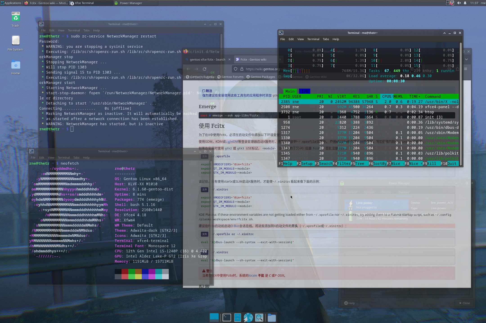
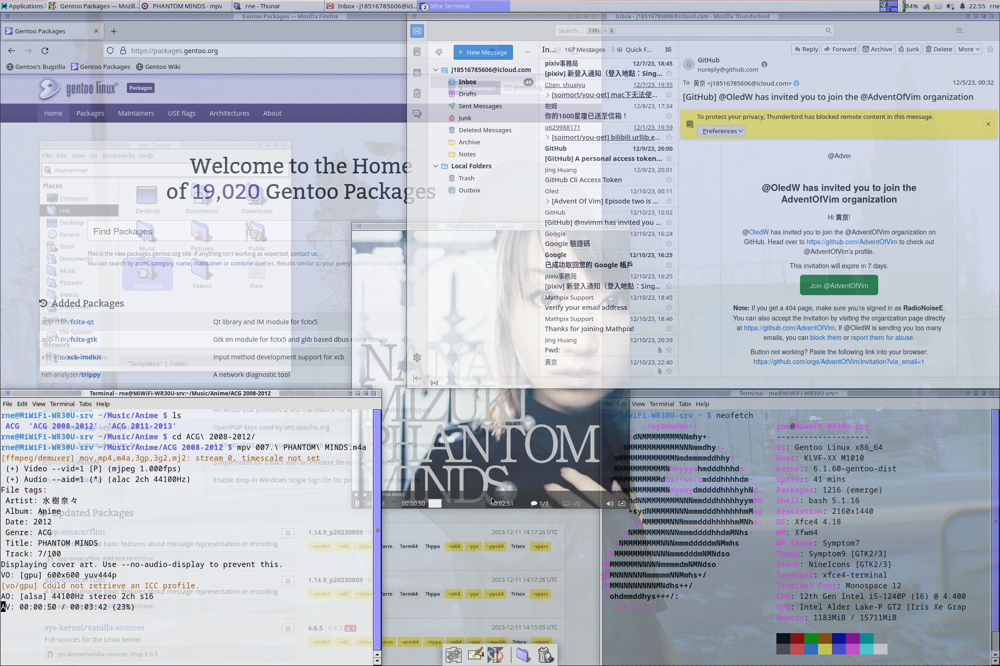
用着感觉挺舒服的。但之后听说了XMonad这个用Haskell写的平铺式窗口管理器，非常好奇于是又重装了系统。发现也很好用。Haskell环境我原来就有，虽然我一般都写OCaml的，Gentoo有slot、不需要担心冲突。至于性能，还是可以的。至于生态，我觉得还是很丰富的，XMonad-contrib里有各种各样的包满足各种各样的需求。配置也很方便，抄Wiki的时候顺便改一改就好了。
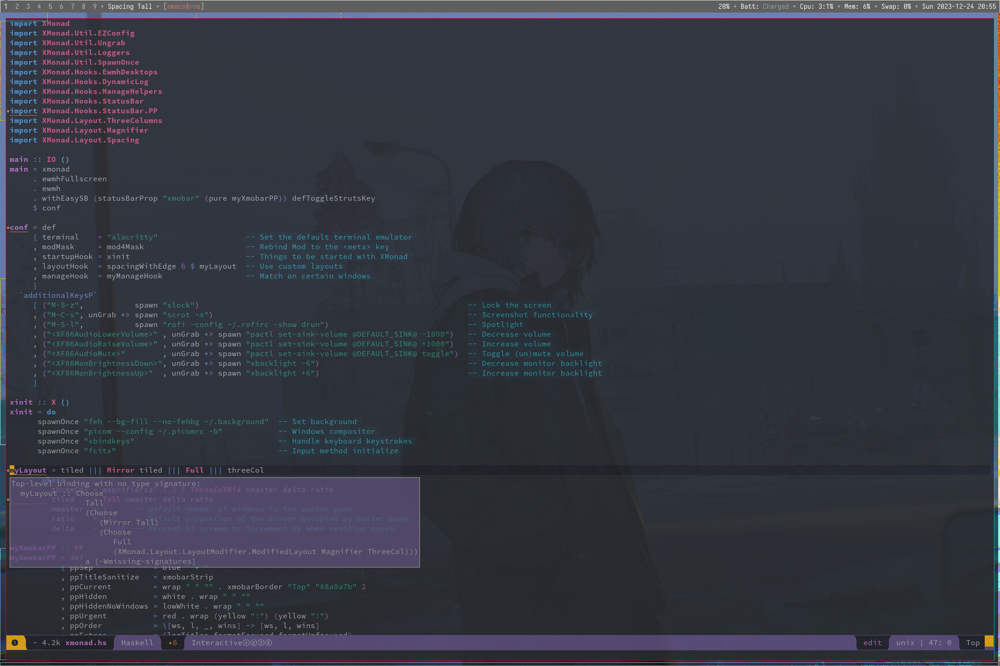
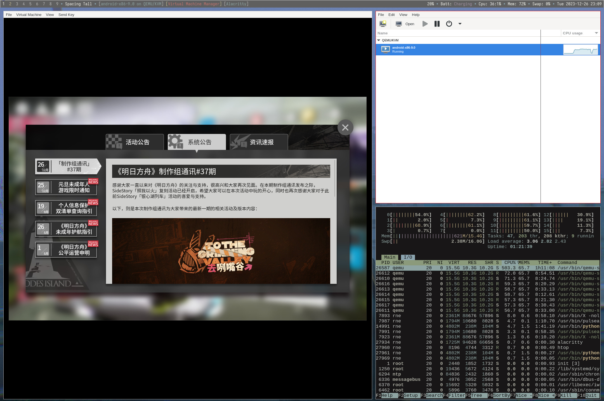
然后第三次的时候装wine-proton的时候手残，处理循环依赖的时候忘了`--oneshot`，然后dispatch-conf完`emerge -avuDN @world`报依赖冲突，然后我又是一通乱搞，依赖冲突越来越多。于是又重装。还是XMonad，配置什么都有了，安装了一个非常干净的系统。但越用X Window System越觉得不干净。于是又重装，这次是swayWM，用Vulkan后端。第五次重装后我终于觉得能一直用下去了。基于Wayland的窗口管理器在字体渲染上整体观感比XOrg好了太多，在XMonad中我还需要额外设置modesetting驱动的tearfree，而触控屏、触控板的手势等是之前不敢想象的。
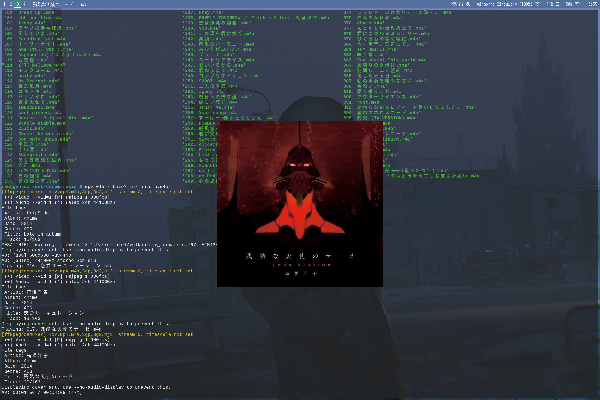
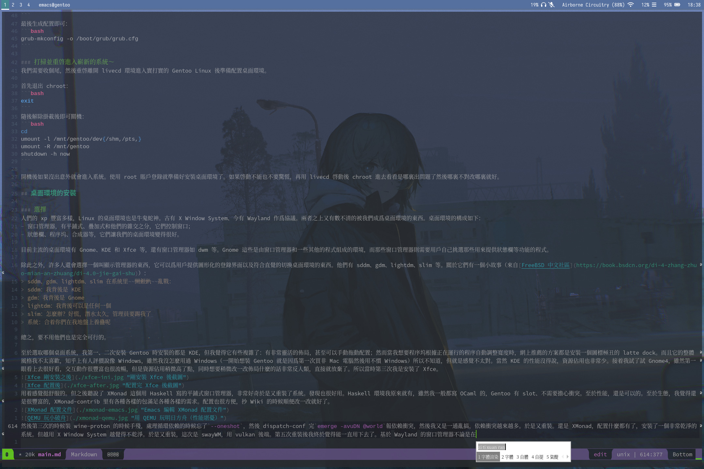
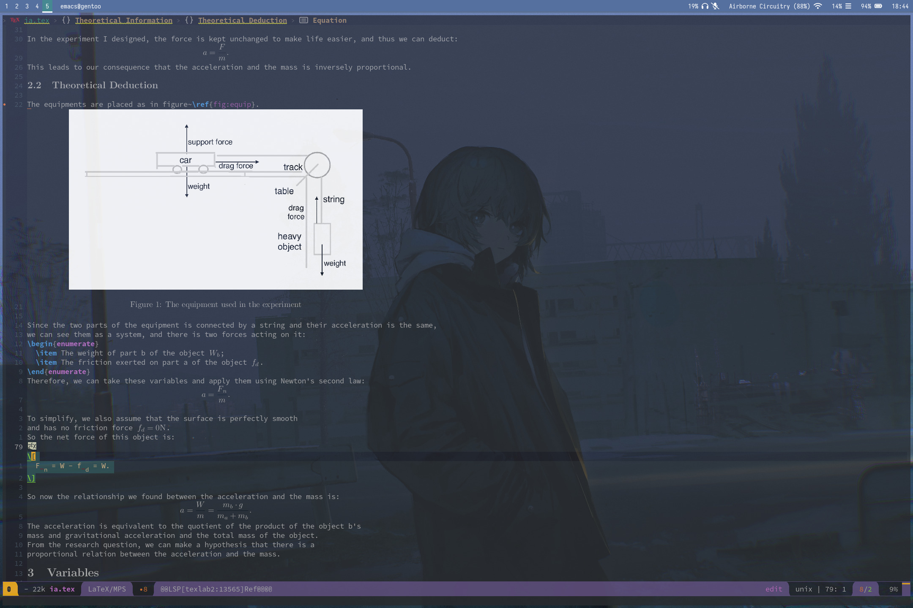
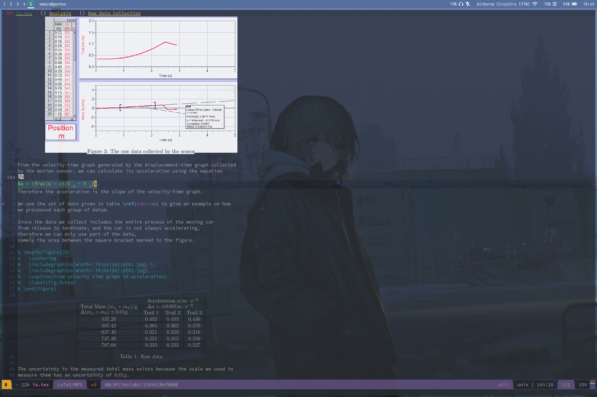
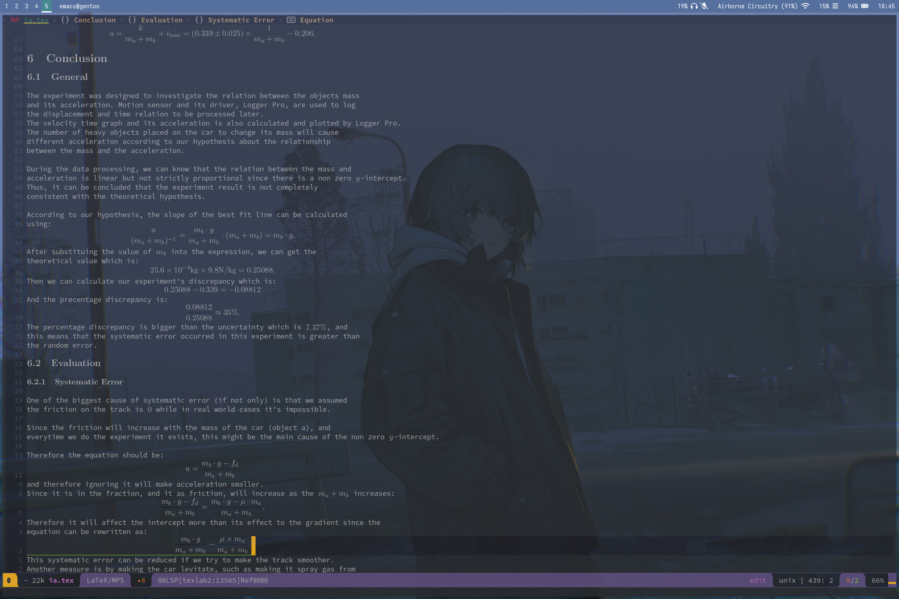
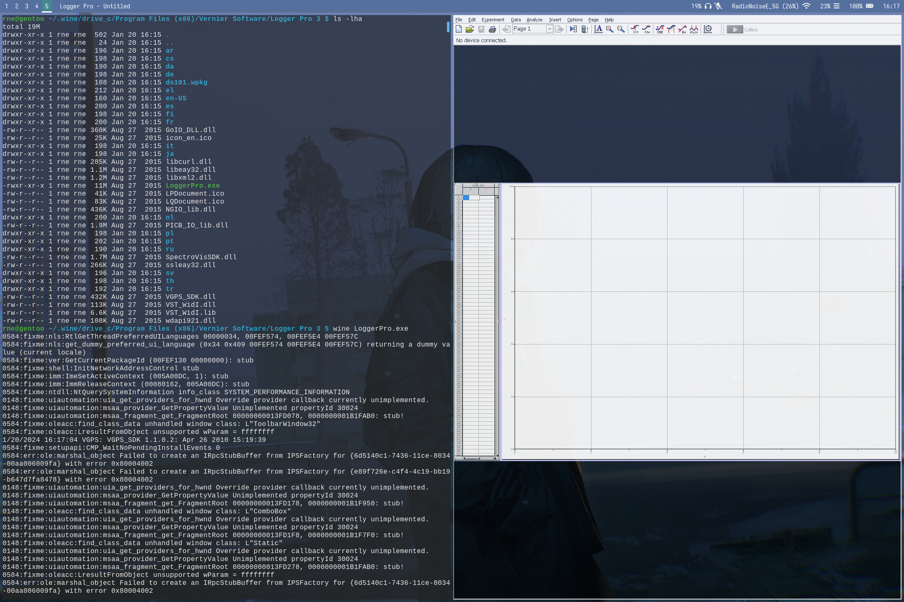

用swayWM，我写完了物理的Internal Assignment、完成了TOK的大作业、写了一个在OCaml里处理JSON用的[库](https://github.com/RadioNoiseE/JSON-ML)、~~还看完了『平稳世代的韦驮天』和『异世界舅舅』~~，感觉十分满意。所以下面将分别讲使用基于X Window System的XMonad和Wayland的swayWM。

如果你希望安装其它窗口管理器，在搜索引擎搜索「Gentoo」后加上该窗口管理器的名字然后根据Wiki安装即可。如果你希望使用桌面环境，重新选择系统配置文件：
```bash
eselect profile list
eselect profile set [num] # 选取上个命令列出的profile中带有桌面环境名字的，如Gnome OpenRC等
```
随后更新：
```bash
emerge -avuDN @world
```
随后遵从Gentoo Wiki的安装指南即可。

### XOrg与XMonad

#### 安装必要软件
创建wm集合：
```bash
touch /etc/portage/sets/wm
echo "x11-base/xorg-server" >> /etc/portage/sets/wm # XOrg服务器，这时可以不装，在安装XMonad时被作为依赖安装
echo "x11-wm/xmonad" >> /etc/portage/sets/wm # 窗口管理器
echo "x11-wm/xmonad-contrib" >> /etc/portage/sets/wm # 对窗口管理器的（社区）扩展
echo "x11-misc/xmobar" >> /etc/portage/sets/wm # 跟Xmonad配套的同样使用Haskell作成的状态栏，可选的还有dzen
echo "x11-misc/picom" >> /etc/portage/sets/wm # 合成器，如果你不需要窗口透明等特效可以不装
echo "media-gfx/feh" >> /etc/portage/sets/wm # 用来设定背景图片的，大概率是必装的
echo "x11-misc/slock" >> /etc/portage/sets/wm # sucklss出品的很精致的锁屏工具
echo "media-gfx/scrot" >> /etc/portage/sets/wm # X11下的截图工具
echo "x11-misc/rofi" >> /etc/portage/sets/wm # 应用程式启动器，不用dmenu是因为它会遮住状态栏，这不好
echo "x11-terms/alacritty" >> /etc/portage/sets/wm # 被誉为最快的终端模拟器，美中不足在于是用Rust写的（编译Rust对Gentoo用户不友好）
```
随后一键安装：
```bash
emerge --ask @wm
```
然后就没有然后了，可以开始配置了。

#### 配置
因为XMonad的特殊性，我们需要先创建一个普通用户（使用XMonad窗口管理器的）：
```bash
useradd -m -G users,wheel,audio,cdrom,cron,portage,usb,video -s /bin/bash larry # 创建Larry奶牛用户
passwd larry # 设置用户密码
```
随后使用`exit`退出root账户后用新创建的用户账户登录后就可以正式开始配置了

首先我们要写`.xinitrc`脚本，当我们使用startx的时候调用的就是这个脚本来启动XMonad的：
```bash
touch ~/.xinitrc
echo "exec dbus-launch --sh-syntax --exit-with-session xmonad" >> ~/.xinitrc
```
即可。

如果你需要在登录到该用户后自动开启XMonad，则在`.bash_profile`中添加：
```bash
if shopt -q login_shell; then
    [[ -f ~/.bashrc ]] && source ~/.bashrc
    [[ -t 0 && $(tty) == /dev/tty1 && ! $DISPLAY ]] && exec startx
else
    exit 1
fi
```
即可。如果你有需要在进入桌面环境时启动的程序（如fcitx），可以选择在这里添加，但更建议使用XMonad的`XMonad.Util.SpawnOnce`进行配置。

随后我们先配置XMonad和XMobar，请参考[官方教程](https://xmonad.org/TUTORIAL.html)，应该不需要Haskell基础。对于上述安装的辅助软件，这里有一个适配的基础配置：
```haskell
import XMonad
import XMonad.Util.EZConfig
import XMonad.Util.Ungrab
import XMonad.Util.Loggers
import XMonad.Util.SpawnOnce
import XMonad.Hooks.EwmhDesktops
import XMonad.Hooks.DynamicLog
import XMonad.Hooks.ManageHelpers
import XMonad.Hooks.StatusBar
import XMonad.Hooks.StatusBar.PP
import XMonad.Layout.ThreeColumns
import XMonad.Layout.Magnifier
import XMonad.Layout.Spacing

main :: IO ()
main = xmonad
     . ewmhFullscreen
     . ewmh
     . withEasySB (statusBarProp "xmobar" (pure myXmobarPP)) defToggleStrutsKey
     $ conf

conf = def
     { terminal    = "alacritty"                   -- Set the default terminal emulator
     , modMask     = mod4Mask                      -- Rebind Mod to the <meta> key
     , startupHook = xinit                         -- Things to be started with XMonad
     , layoutHook  = spacingWithEdge 6 $ myLayout  -- Use custom layouts
     , manageHook  = myManageHook                  -- Match on certain windows
     }
  `additionalKeysP`
     [ ("M-S-z",           spawn "slock")                                                          -- Lock the screen
     , ("M-C-s", unGrab *> spawn "scrot -s --quality 100 -e \'mv $f ~/Images/\'")                  -- Screenshot functionality
     , ("M-S-l",           spawn "rofi -config ~/.rofirc -show drun")                              -- Spotlight
     , ("<XF86AudioLowerVolume>" , unGrab *> spawn "pactl set-sink-volume @DEFAULT_SINK@ -1000")   -- Decrease volume
     , ("<XF86AudioRaiseVolume>" , unGrab *> spawn "pactl set-sink-volume @DEFAULT_SINK@ +1000")   -- Increase volume
     , ("<XF86AudioMute>"        , unGrab *> spawn "pactl set-sink-volume @DEFAULT_SINK@ toggle")  -- Toggle (un)mute volume
     , ("<XF86MonBrightnessDown>", unGrab *> spawn "xbacklight -6")                                -- Decrease monitor backlight
     , ("<XF86MonBrightnessUp>"  , unGrab *> spawn "xbacklight +6")                                -- Increase monitor backlight
     ]

xinit :: X ()
xinit = do
      spawnOnce "feh --bg-fill --no-fehbg ~/.background"  -- Set background
      spawnOnce "picom --config ~/.picomrc -b"            -- Windows compositor
      spawnOnce "fcitx"                                   -- Input method initialize

myLayout = tiled ||| Mirror tiled ||| Full ||| threeCol
       where
         threeCol = magnifiercz' 1.3 $ ThreeColMid nmaster delta ratio
         tiled    = Tall nmaster delta ratio
         nmaster  = 1      -- Default number of windows in the master pane
         ratio    = 1/2    -- Default proportion of the screen occupied by master pane
         delta    = 2/100  -- Percent of screen to increment by when resizing panes

myXmobarPP :: PP
myXmobarPP = def
           { ppSep             = blue " • "
           , ppTitleSanitize   = xmobarStrip
           , ppCurrent         = wrap " " "" . xmobarBorder "Top" "#8a9a7b" 2
           , ppHidden          = white . wrap " " ""
           , ppHiddenNoWindows = lowWhite . wrap " " ""
           , ppUrgent          = red . wrap (yellow "!") (yellow "!")
           , ppOrder           = \[ws, l, _, wins] -> [ws, l, wins]
           , ppExtras          = [logTitles formatFocused formatUnfocused]
           }
         where
           formatFocused   = wrap (white    "[") (white    "]") . red  . ppWindow
           formatUnfocused = wrap (lowWhite "[") (lowWhite "]") . cyan . ppWindow
           ppWindow :: String -> String
           ppWindow = xmobarRaw . (\w -> if null w then "untitled" else w) . shorten 20
           blue, lowWhite, magenta, red, white, yellow, green, cyan :: String -> String
           magenta  = xmobarColor "#a292a3" ""
           blue     = xmobarColor "#8ba4b0" ""
           white    = xmobarColor "#C8C093" ""
           yellow   = xmobarColor "#c4b28a" ""
           red      = xmobarColor "#c4746e" ""
           lowWhite = xmobarColor "#bbbbbb" ""
           green    = xmobarColor "#8a9a7b" ""
           cyan     = xmobarColor "#8ea4a2" ""

myManageHook :: ManageHook
myManageHook = composeAll
             [ isDialog                 --> doFloat
             , className =? "mpv"       --> doFloat
             , className =? "fontforge" --> doFloat
             ]
```
以及对应的XMobar配置：
```Haskell
Config { overrideRedirect = False
       , font     = "xft:IBM3270-13.2:antialias=ture,notoSansMonoCJKjp-11.6"
       , additionalFonts = [ "xft:notoSansMonoCJKjp-10" ]
       , bgColor  = "#5f5f5f"
       , fgColor  = "#f8f8f2"
       , position = TopW L 100
       , persistent  = False
       , hideOnStart = False
       , commands = [ Run MultiCpu
                        [ "--template" , "Cpu: <total0>:<total1>%"
                        , "--Low"      , "50"
                        , "--High"     , "85"
                        , "--low"      , "white"
                        , "--normal"   , "white"
                        , "--high"     , "white"
                        ] 10
                    , Run Alsa "default" "Master"
                        [ "--template", "<volumestatus>"
                        , "--suffix"  , "True"
                        , "--"
                        , "--on", ""
                        ]
                    , Run Battery
                        [ "--template" , "Batt: <acstatus>"
                        , "--Low"      , "10"
                        , "--High"     , "80"
                        , "--low"      , "white"
                        , "--normal"   , "white"
                        , "--high"     , "white"
                        , "--"
                        , "-o"	, "<left>% (<timeleft>)"
                        , "-O"	, "<fc=#a292a3>Charging</fc>"
                        , "-i"	, "<fc=#8ea4a2>Charged</fc>"
                        ] 50
                    , Run DynNetwork
                        [ "--template" , "<dev>: <tx>:<rx>kB/s"
                        , "--Low"      , "1000"
                        , "--High"     , "5000"
                        , "--low"      , "white"
                        , "--normal"   , "white"
                        , "--high"     , "white"
                        ] 10
                    , Run Memory ["--template", "Mem: <usedratio>%"] 10
                    , Run Swap [] 10
                    , Run Date "%a %Y-%m-%d %H:%M" "date" 10
                    , Run XMonadLog
                    ]
       , sepChar  = "%"
       , alignSep = "}{"
       , template = "%XMonadLog% }{ %alsa:default:Master% <fc=#8ba4b0>•</fc> %battery% <fc=#8ba4b0>•</fc> %multicpu% <fc=#8ba4b0>•</fc> %memory% <fc=#8ba4b0>•</fc> %date% "
       }
```
对于快捷键绑定，调整声音和屏幕亮度处需要你使用`pulseaudio`和`acpilight`，安装／配置请自行搜索Gentoo Wiki。同时为了使状态栏的配置正生效，你需要安装IBM的3270字体和Noto CJK字体。将他们分别放在`~/.xmonad/xmonad.hs`和`~/.xmobar`文件中，随后执行：
```bash
xmobar --recompile
```
若无报错则可以使用。

接下来就是一些杂项的配置，如合成器picom：
```conf
vsync=true
experimental-backend=true
shadow=false
shadow-radius=7
shadow-opacity=.76
shadow-offset=-7
shadow-blue=.1
inactive-opacity=0.79
frame-opacity=0.76
inactive-opacity-overwrite=false
active-opacity=0.87
wintypes:
{
  tooltip = { fade = true; shadow = false; opacity = 0.75; focus = true; full-shadow = false; };
  dock = { shadow = false; clip-shadow-above = true; opacity = 1 }
  dnd = { shadow = false; }
  popup_menu = { opacity = 0.77; shadow = false; }
  dropdown_menu = { opacity = 0.77; shadow = false; }
};
opacity-rule = [
  "100:class_g = 'mpv' && focused",
  "100:class_g = 'Virt-manager' && focused",
  "100:class_g = 'fontforge' && focused"
]
```

将你希望配置的东西配置完就可以重启进入XMonad桌面环境了。随着使用慢慢打磨自己的配置就好。

#### 常见事故
如果你在使用时发现有屏幕撕裂等的现象，请先阅读[这篇](https://wiki.gentoo.org/wiki/Xorg/Guide)关于XOrg的文章，随后以「Screen Tearing」「XOrg」以及你的显卡配置在搜索引擎上搜索方案，常见的包括开启VSync、Intel显卡使用modesetting驱动替代xf86驱动等。

### Wayland与SwayWM

#### 安装必要软件
首先创建winmgr集合：
```bash
touch /etc/portage/sets/winmgr # 创建集合
echo "media-libs/vulkan-loader" >> /etc/portage/sets/winmgr # 如果你使用默认的gles2后端则不需要（如果你不知道这是什么那就不要加）
echo "dev-libs/wayland" >> /etc/portage/sets/winmgr # Wayland协议
echo "x11-base/xwayland" >> /etc/portage/sets/winmgr # 支持在Wayland下运行X11应用
echo "gui-wm/sway" >> /etc/portage/sets/winmgr # 窗口管理器
echo "gui-apps/waybar" >> /etc/portage/sets/winmgr # 状态栏
echo "gui-apps/swaybg" >> /etc/portage/sets/winmgr # 背景图片
echo "gui-apps/swayidle" >> /etc/portage/sets/winmgr # 定时任务，如一段时间未操作后休眠等
echo "gui-apps/swaylock" >> /etc/portage/sets/winmgr # 锁屏用
echo "gui-apps/mako" >> /etc/portage/sets/winmgr # 通知弹窗
echo "gui-apps/grim" >> /etc/portage/sets/winmgr # 截屏用
echo "gui-apps/foot" >> /etc/portage/sets/winmgr # 轻量级的Wayland原生终端模拟器
echo "gui-apps/wl-clipboard" >> /etc/portage/sets/winmgr # 剪切板
echo "dev-libs/bemenu" >> /etc/portage/sets/winmgr # dmenu来到Wayland
```
然后先`emerge --pretend --ask @winmgr`看一下USE旗标有没有需要改动的，最后安装集合就好。

#### 配置
swayWM是i3的移植，而且网上有很多资料。它的配置文件最好放在`~/.config/sway/config`，有一些需要注意的是：
```bash
# ~/.config/sway/config

set $term foot # 你挑选的终端模拟器，比如我用的「足」模拟器
set $menu bemenu-run -b -n -fn iosevka:10 --tb "#00000000" --fb "#00000000" --cb "#00000000" --nb "#00000000" --hb "#00000000" --fbb "#00000000" --sb "#09ABAC5A" --ab "#00000000" --scb "#00000000" --tf "#E1E1E1" --border 6 --bdr "#00000000" --width-factor 1 --wrap --prompt "spotlight" --hp 4 --no-spacing --sf "#D9534F" | xargs swaymsg exec -- # 如果你想让bemenu背景透明出现在屏幕底部
set $lock swaylock -u -e -f -c 00000000 # 去除swaylock的有点强奸审美的解锁效果（真是越来越怀念slock了），你还可以「让锁屏背景透明」什么的，它支持锁屏时显示图片，你只需要写一个脚本调用image magick预处理就好
for_window [class=".*"] opacity set 0.84 # 如果你希望让所有窗口透明
for_window [app_id="mpv"] floating enable, opacity set 1 # 如果你希望对一些窗口特殊对待（我相信你肯定不希望mpv背景是透明的），同时让它浮动
xwayland enabled # 支持X11应用
for_window [window_role="pop-up"] floating enable
for_window [window_role="bubble"] floating enable
for_window [window_role="dialog"] floating enable
for_window [window_type="dialog"] floating enable
for_window [window_role="task_dialog"] floating enable
for_window [window_type="menu"] floating enable
for_window [window_type="notification"] floating enable
for_window [app_id="floating"] floating enable
for_window [app_id="floating_update"] floating enable, resize set width 1000px height 600px
for_window [class="(?i)pinentry"] floating enable
for_window [title="Administrator privileges required"] floating enable

for_window [title="About Mizilla Firefox"] floating enable
for_window [window_role="About"] floating enable
for_window [app_id="firefox" title="Library"] floating enable, border none, sticky enable
for_window [title="Firefox - Sharing Indicator"] kill # 智慧的窗口判断，Gentoo Wiki上抄的
hide_edge_borders smart
gaps inner 6
gaps outer 0
smart_gaps off # 设置边框间距
default_border none
default_floating_border none # 去掉每个窗口的标题栏
exec mako # 需要在启动时启动的应用，比如你要用fcitx输入方法，就是exec fcitx5 -d
bindsym Print exec grim ~/Images/ps_$(date +"%Y%m%d%H%M%S").png
bindsym $mod+Print exec grimshot save area ~/Images/psa_$(date +"%Y%m%d%H%M%S").png # 截屏的快捷键
bar {
    status_command waybar
    mode invisible
} # 标题栏使用waybar时的配置
```
等等很多其他的配置，建议在[这里](https://swaywm.org/)和[这里](https://github.com/swaywm/sway)等地方看看如何配置。

至于waybar状态栏，主要就是`~/.config/waybar/config`和`~/.config/waybar/style.css`两个文件。一个语法非常直观、另一个就是CSS文件，从网上找找别人的配置、看看文档、抄一抄改一改就好。配色倒是个难题，我从MacOS同样背景图片的状态栏上抄了颜色，感觉不那么违和了。
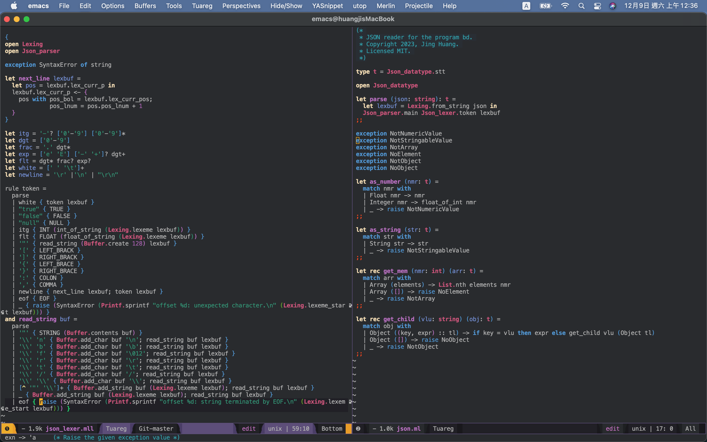

#### 常见问题
我思来想去感觉只有输入法有点坑了。众所周知，fcitx5对Wayland的支持是比较好的，然而fcitx5被`amd64`的关键词蒙蔽了。所以在iptm集合里我们需要写的是：
```emerge
app-i18n/fcitx:5
app-i18n/fcitx-gtk:5 # 一定要注意这个，没有它在所以基于gtk的软件下候选弹窗都是没有的，不知为什么fcitx5里包含了qt的但没gtk
app-i18n/fcitx-rime:5 # 换成你想用的输入法（框架）
app-i18n/fcitx-configtool:5 # 图像化配置界面，还是建议装一个的，当然也可以手动编辑那个配置文件或者沿用之前的配置
```
然后在`~/.bashrc`或者类似的什么地方写上这些环境变量：
```bash
export WLR_RENDERER=vulkan
export GTK_IM_MODULE=fcitx # emacs GDK_IS_WAYLAND_DISPLAY assertion fail
export QT_IM_MODULE=fcitx
export XMODIFIERS=@im=fcitx
```
注意`GTK_IM_MODULE`这一变量，官方的建议是用`wayland`的值，但emacs会报错。所以如果你不用emacs就把它换成`wayland`。

## 吐槽与展望
Gentoo是1999年10月4日出现的，现在已经2024年了，真的是「20 years of compile」，而它很有名的一点就是需要编译。网上有人用Gentoo把硬盘弄坏的、被怀疑在挖矿的、把主板烧了的，各种各样。然而就在不久就之前，Gentoo的二进制更成熟了。真是一件大好事（虽然估计对我没什么影响就是了）。

关于Gentoo的安装，我这里只是给了一个大概的思路：如果你真的想要用Gentoo的话，Gentoo Wiki绝对是你的好伙伴。从电源管理到内核的pgo优化再到如何读写中文、如何用QEMU虚拟化。

本来这里该写的是吐槽，但我发现真的没什么好说的，只能说希望随着硬件性能的提升Gentoo能够凭借极致的客制化成为主流发行版之一吧？

## 参考文献以及学习资料
很多链接都放在文中了，所以这里不能说还有很多学习资料、只能说一个我都不想写了。写文章真累。如果有名词使用，概念错误，或是可以优化的步骤，欢迎评论或者直接发我邮件：[`j18516785606@icloud.com`](j18516785606@icloud.com)（常用）或[`RadioNoiseE@gmail.com`](RadioNoiseE@gmail.com)（说实话、这个邮箱我已经几个月没查看过了）。

祝各位都能调教出一个和自己xp的系统。
